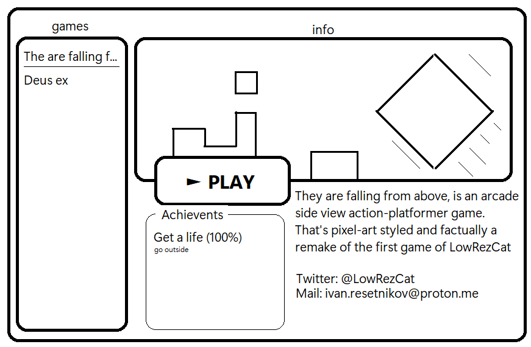

# 🎮 Game Manager 🎮

Remake of steam, but open source and with full controll over your games data




## ⬇️ Install

Use [git](https://git-scm.com/) to download repo:

```bash
$ git clone https://github.com/ivan-resetnikov/Games-Handler
```


## 🪛 Usage

After installing the game manager, run script below in terminal,\
to change active directory to game's one:

```bash
$ cd Game-Manager/bin
```

Then start application using:
```bash
$ main.exe
```

Now you are good to go!

## 🪛 Usage (Developer)

After installing the game manager, run script below in terminal,\
to change active directory to game's one:

```bash
$ cd Game-Manager
```

Then activate virtual environment:

```bash
$ venv.bat
```

Then go to source folder:

```bash
$ cd src
```

After that run script below to start the game:

```bash
$ python main.py
```

Now you are good to go!

## ➕ Contributing

Contributing is greatly apreciated!\
Checkout "CONTRIBUTE.md" for more info!


## 💸 Donation

Donations are **very** appreciated!

- **Patreon is [here](https://www.patreon.com/join/9723605?u=9723605)**